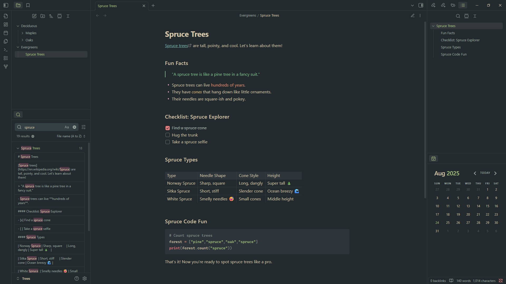

# Everforest Spruce

**Everforest Spruce** is an Obsidian theme based on [Everforest](https://github.com/sainnhe/everforest) by [Sainnhe Park](https://github.com/sainnhe), created as a decluttered alternative to existing variations. It aims to be minimalistic while guiding focus to important text sections via the palette's accent colors.

> Everforest Spruce is currently **dark-mode only**.

## Features

- Pleasant and subtle Everforest color scheme
- Visual separation through colored elements
- Reduced eye strain via a dimmed background
- Sleek mono-color headings
- Readable code blocks based on Everforest's highlighting rules
- Simplified tables for a solidifed design

## Attribution

This project uses code from [sainnhe/everforest](https://github.com/sainnhe/everforest), whose copyright notice and license are included in the [`ATTRIBUTIONS.md`](ATTRIBUTIONS.md) file.
